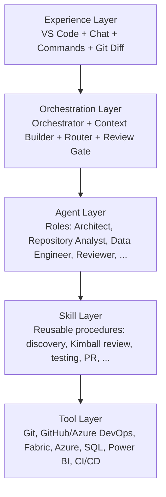

# AI-Assisted Data Engineering Consulting Platform

## What this is

A reusable framework of agent definitions, skills, standards, templates and
commands that helps an AI coding agent act like a disciplined virtual
Principal Data Engineering team inside a client repository — grounded in
that repository's actual state, proficient in the Microsoft data platform
(Microsoft Fabric, Azure, Power BI, SQL, Python, PySpark), and built around
Kimball dimensional modelling as the default analytical standard.

It is designed to be bootstrapped into any number of separate client
repositories without ever mixing client context between them.

## What this is not

- Not a client repository. It must never contain client-specific business
  facts, architecture, credentials, tenant/subscription identifiers or data.
- Not a single giant system prompt. Responsibilities are split across
  agents (roles), skills (procedures) and standards (engineering principles).
- Not a fully automated deployment system. Production-changing operations
  stay human-controlled until that is explicitly changed in a later phase.
- Not a finished platform. This repository currently implements **Phase 1 —
  Foundation** only (see [Implementation status](#implementation-status)).

## Architecture

Five logical layers, from the user-facing surface down to concrete tools:



Each client repository that uses this framework forms its own separate
context and security boundary. The framework is invoked *against* a client
repository; it never stores that repository's facts itself.

## Agents vs. skills

- An **agent** (`agents/*.agent.md`) is a role or responsibility — *who* is
  reasoning and what it is accountable for.
- A **skill** (`skills/*/SKILL.md`) is a reusable, repeatable procedure —
  *how* a task gets done, including inputs, evidence requirements, and
  quality checks.
- A skill may be used by more than one agent. Procedures are not duplicated
  across agent prompts; agents reference skills instead.
- Orchestration is a skill ([`orchestration`](skills/orchestration/SKILL.md)),
  not an agent: it has to run in the main conversation, the only place
  that can stop for the user's approval and show intermediate results.
  The four agents run as subagents for work that benefits from its own
  context: discovery, architecture, bounded implementation and
  independent review.

## Client isolation

This framework repository holds **generic, reusable engineering knowledge
only**. It must never contain:

```text
data-engineering-ai/
└── projects/
    ├── client-a/
    ├── client-b/
    └── client-c/
```

Instead, each client gets its own physically separate repository with a
thin AI overlay (`AGENTS.md` + `.ai/`) created from this framework's
`templates/`. A typical working layout looks like:

```text
work/
├── data-engineering-ai/      <- this repository
├── client-a/
│   └── repo-1/
├── client-b/
│   └── repo-1/
└── client-c/
    └── repo-1/
```

Client-specific facts, rules, glossary, technical debt and decisions live
inside the corresponding client repository's `.ai/` directory — never here,
and never copied from one client repository into another.

## How to bootstrap a client repository

1. Open the target client repository in VS Code alongside this framework.
2. Run the [`/bootstrap-project`](commands/bootstrap-project.md) command.
3. The agent inspects the client repository first (it must not invent
   facts), then proposes a client `AGENTS.md` and a `.ai/` overlay
   (`PROJECT.md`, `ARCHITECTURE.md`, `DATA-MODEL.md`, `GLOSSARY.md`,
   `STANDARDS.md`, `TECH-DEBT.md`, `manifest.yaml`, `adr/`, `runbooks/`)
   from this framework's `templates/`.
4. Anything that cannot be determined from the repository is marked as
   unknown, not guessed.
5. The client repository owner reviews and commits the overlay like any
   other change.

## How to use commands

Commands (`commands/*.md`) are reusable workflows that chain skills and
agents together:

| Command | Purpose |
|---|---|
| [`/ticket`](commands/ticket.md) | Run a ticket end to end, with its state in a resumable ticket note |
| [`/bootstrap-project`](commands/bootstrap-project.md) | Create a client repository's AI overlay from templates |
| [`/understand-repository`](commands/understand-repository.md) | Run repository discovery and produce a structured project model |
| [`/architecture-review`](commands/architecture-review.md) | Run discovery plus a qualitative architecture review |
| [`/plan-ticket`](commands/plan-ticket.md) | Produce an implementation plan without changing files |
| [`/review-pr`](commands/review-pr.md) | Review a diff/branch as a senior/principal engineer |
| [`/review-data-model`](commands/review-data-model.md) | Review a dimensional/semantic model against Kimball standards |
| [`/investigate`](commands/investigate.md) | Run evidence-driven incident / root-cause analysis |
| [`/prepare-pr`](commands/prepare-pr.md) | Build a PR description from the actual diff/tests/reviews |

A small Python bug does not need every specialist invoked. The
[`orchestration`](skills/orchestration/SKILL.md) skill classifies the task
first and invokes only the agents/skills the task actually requires.

Skills can be invoked directly too, e.g. `/data-engineering-ai:capture-learnings`.

## Use with Claude Code

This repository is also a Claude Code plugin and its own single-plugin
marketplace (`.claude-plugin/`). Install it once at user scope, so it is
available in every client repository without being copied into any of them:

```bash
claude plugin marketplace add JoroChervenski/data-engineering-ai
claude plugin install data-engineering-ai@data-engineering-ai --scope user
claude plugin marketplace update data-engineering-ai   # pull new commits
claude plugin update data-engineering-ai@data-engineering-ai
```

Inside a client repository:

- Commands are namespaced, e.g. `/data-engineering-ai:ticket <ticket>`,
  `/data-engineering-ai:bootstrap-project`,
  `/data-engineering-ai:review-pr`.
- Agents are available as subagents `data-engineering-ai:repository-analyst`,
  `:architect`, `:data-engineer`, `:reviewer`.
- Skills load on demand when a task matches their description.
- The client overlay (`AGENTS.md` + `.ai/`) lives in the client repository.
  Claude Code reads `CLAUDE.md`, so add one containing `@AGENTS.md`.

Each agent, skill and command starts with Claude Code frontmatter and a
short note pointing at `${CLAUDE_PLUGIN_ROOT}`, so the relative links to
`standards/` and `templates/` resolve from the installed plugin. The
architecture review skill is named `architecture-assessment` so it does not
collide with the `/architecture-review` command.

## Implementation status

**Phase 1 — Foundation, with task-driven Phase 2 improvements (current).**
4 core agents, 10 skills, 8 engineering standards, 10 client-overlay
templates, 9 commands, and a static validator. Enough to bootstrap a real
client repository, run tickets end to end, and feed lessons back.

Phase 2 so far: orchestration moved into the main conversation, the
`/ticket` workflow with resumable ticket notes, and the
`capture-learnings` loop with its [`inbox/`](inbox/README.md).

Not yet implemented (by design — see the roadmap below):

- Deeper behaviour for the remaining agents and skills (Phase 2, driven
  by inbox items rather than up front).
- Specialist agents beyond the Phase 1 five, e.g. Fabric Architect, SQL
  Specialist, Spark Specialist, Semantic Model Specialist, Security
  Reviewer, Production Reliability Reviewer, DevOps Agent, PR Agent
  (Phase 3).
- External tool/MCP integrations: GitHub, Azure DevOps, Microsoft Fabric,
  Azure, Power BI, SQL (Phase 4).
- Controlled write automation: branches, commits, pushes, PRs, pipeline
  triggers (Phase 5).
- Advanced automation: automated PR review, drift detection, semantic-model
  linting, CI enforcement (Phase 6).

## Updating the framework

The framework improves from real work in two loops:

1. **Per task.** `/ticket` records learning candidates in the ticket note
   as they happen. At close, the
   [`capture-learnings`](skills/capture-learnings/SKILL.md) skill
   proposes project facts for the client's `.ai/` overlay and anonymised,
   generic lessons for [`inbox/`](inbox/README.md). Nothing is written
   without approval.
2. **Across tasks.** In this repository, inbox items are promoted into
   agents, skills, standards, templates or commands once they meet the
   promotion rule (seen three times, prevents a Critical/High failure, or
   the owner asks). See the Inbox section of [`AGENTS.md`](AGENTS.md).

`capture-learnings` finds the inbox through the environment variable
`DATA_ENGINEERING_AI_SRC`, the path of your working clone. Set it once in
`~/.claude/settings.json`:

```json
{ "env": { "DATA_ENGINEERING_AI_SRC": "/path/to/data-engineering-ai" } }
```

Ad-hoc changes, from smallest to widest reach:

| Scope | How | Takes effect |
|---|---|---|
| One client only | Edit its `.ai/` overlay, or add a project skill under the client's `.claude/skills/<name>/SKILL.md` | Immediately / next session |
| Framework, trial | Edit the working clone, then start `claude --plugin-dir /path/to/data-engineering-ai` | That session |
| Framework, rollout | Run `python3 tests/validate_framework.py`, commit and push, then `claude plugin marketplace update data-engineering-ai` and `claude plugin update data-engineering-ai@data-engineering-ai`; start a new session | Every client repository |

Notes:

- Never edit the copies under `~/.claude/plugins/`. They are managed by
  Claude Code and replaced on update, and the running plugin is the
  commit-pinned copy under `~/.claude/plugins/cache/`.
- `plugin.json` has no `version`, so every commit is a new version. If a
  `version` is added, it must be bumped on every release, or updates are
  skipped.
- Keep the untracked `.client-terms` file (one client term per line) in
  the working clone, so the validator catches client terms before they
  are committed.

## Roadmap

See `AI_DATA_ENGINEERING_PLATFORM_IMPLEMENTATION_SPEC.md` for the full
phased plan (Phases 2–6). Specialist agents, external integrations and
write automation are only started on explicit instruction; improvements
to the existing parts follow the inbox (see [`AGENTS.md`](AGENTS.md),
rule 7).

## Safety model

- **Repository truth over AI memory.** Architectural and implementation
  decisions are based on the current state of the repository being worked
  on, not on previously observed state.
- **Strict client isolation.** Generic framework vs. client-specific
  overlay, enforced by directory structure and by the agent/skill
  instructions themselves.
- **Git is the system of record.** Decisions that matter become reviewable
  repository artifacts (code, tests, docs, ADRs, PR descriptions) rather
  than an undocumented AI-only knowledge layer.
- **Least privilege.** Tools are conceptually leveled L0 (read) through L3
  (deploy). Phase 1 only requires L0/L1 (observe, modify local working
  tree). Remote writes and cloud deployment stay human-controlled.
- **No secrets, ever.** Never in `AGENTS.md`, manifests, documentation,
  prompts, skill or agent definitions. See
  [`standards/security.md`](standards/security.md).
- **Human review stays in the loop.** Agents prepare plans, diffs and PR
  descriptions; they do not auto-approve or auto-merge.
